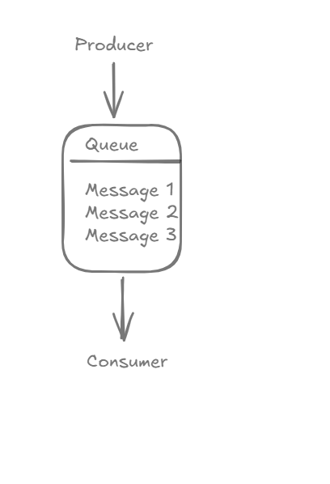
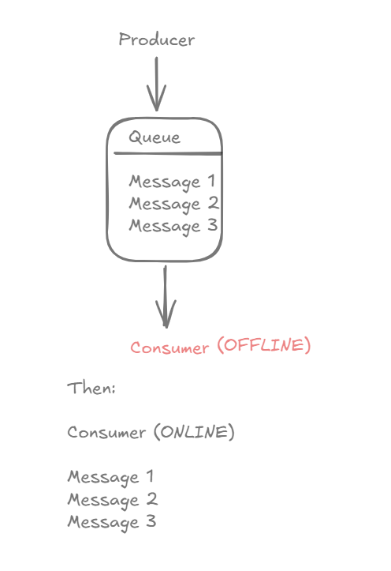
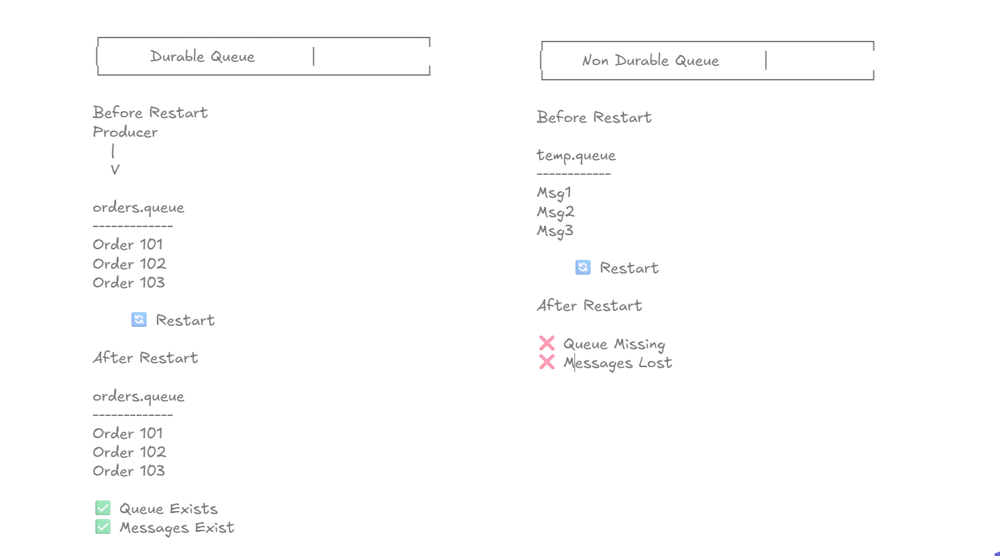
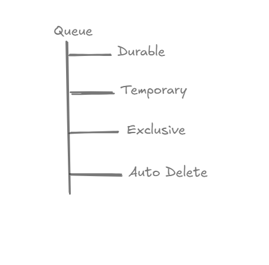
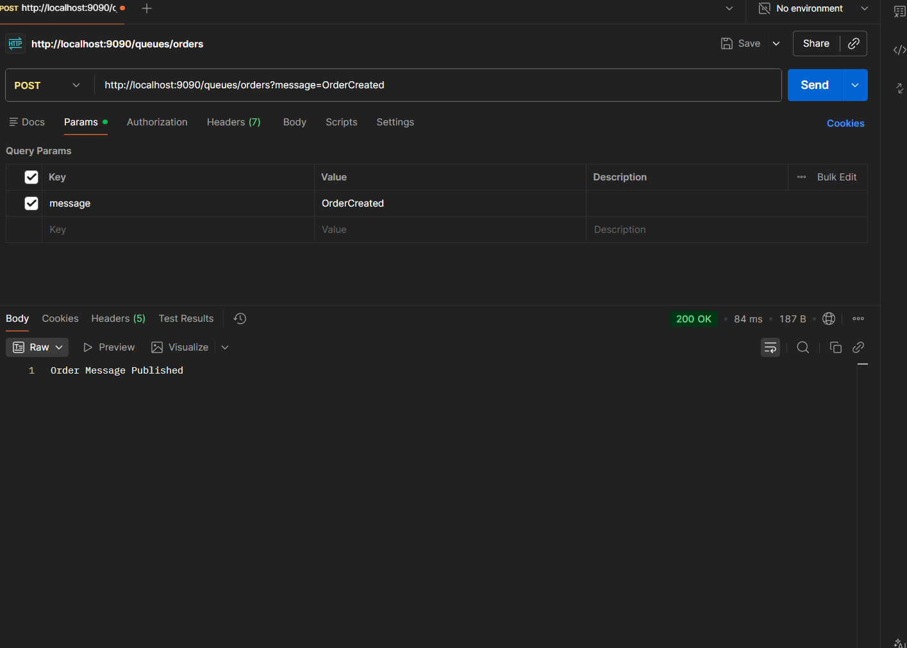
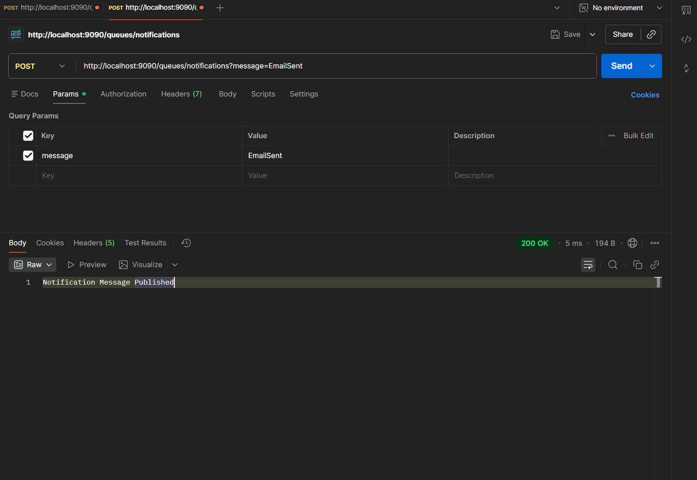
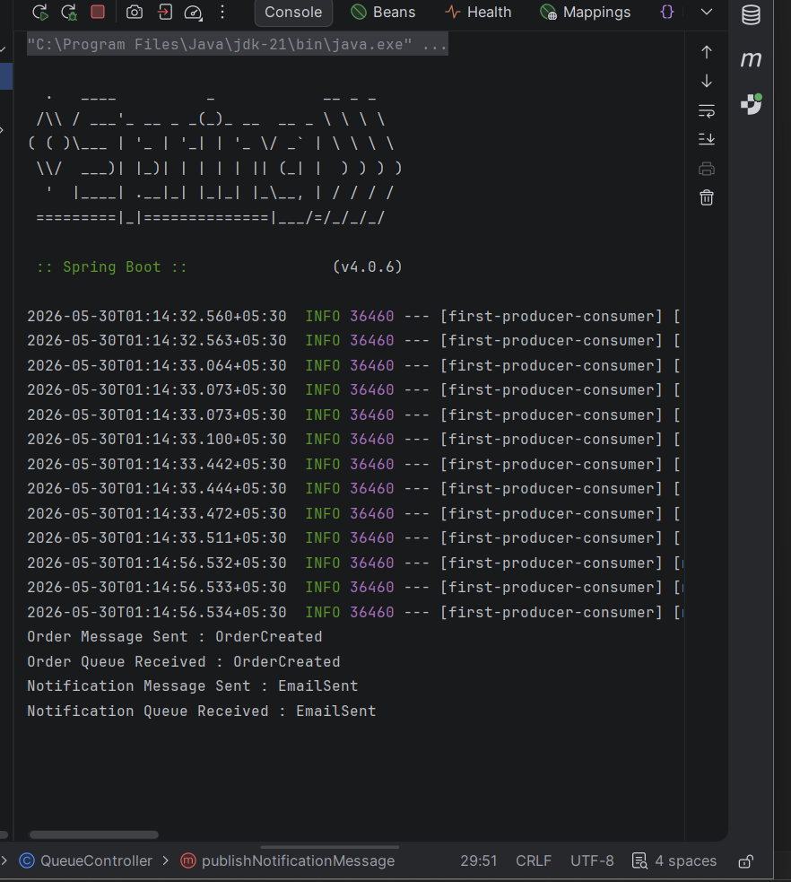
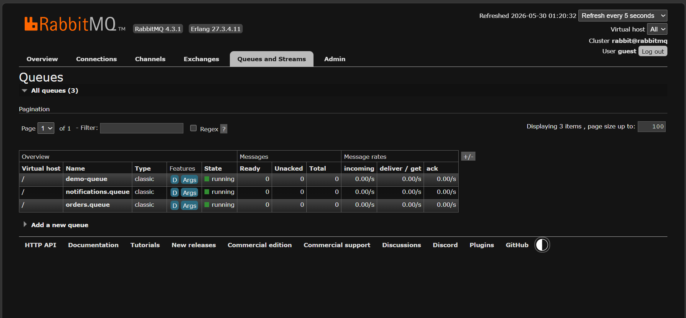
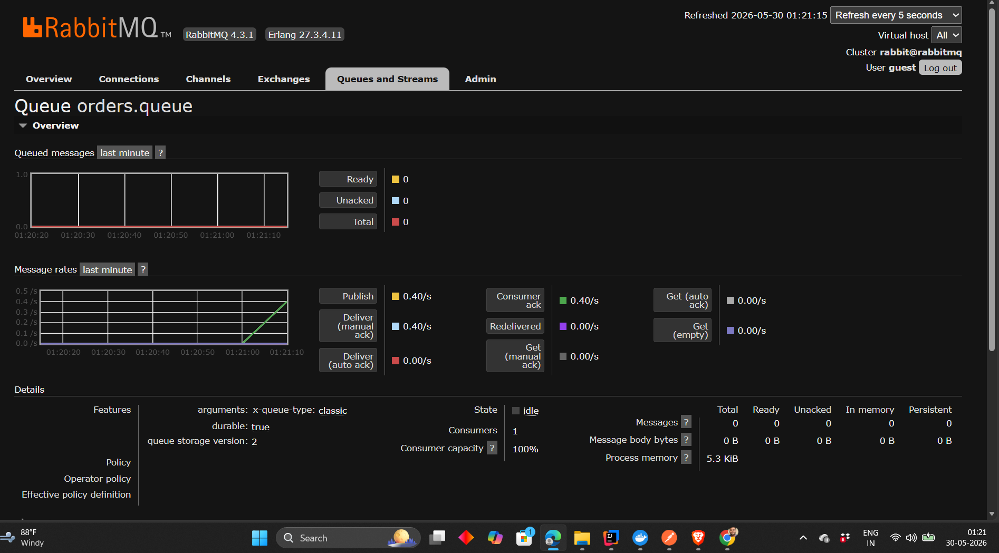
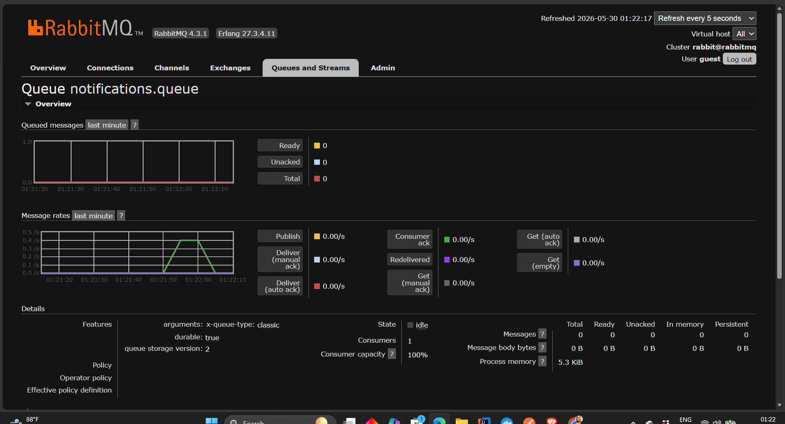

# Queues Deep Dive

## Learning Objectives

After completing this chapter, you will understand:

* What a Queue is
* Why Queues exist
* How RabbitMQ stores messages
* What happens when consumers are offline
* Durable vs Non-Durable Queues
* Different Queue Types
* Queue Isolation
* Queue Best Practices
* How to work with multiple queues using Spring Boot

---

# What Is A Queue?

A Queue is one of the most fundamental building blocks in RabbitMQ.

A Queue acts as a temporary storage area for messages.

When a Producer sends a message, RabbitMQ stores the message inside a Queue until a Consumer processes it.

Think of a Queue as a waiting room.

Messages wait inside the Queue until a Consumer is available.

Without Queues, RabbitMQ would not be able to decouple Producers from Consumers.

---

# Queue Message Storage



The Queue acts as a buffer between Producers and Consumers.

Message Flow:

```text
Producer
    |
    V

Queue
    |
    ├── Message 1
    ├── Message 2
    ├── Message 3
    |
    V

Consumer
```

When a Producer publishes a message:

1. RabbitMQ receives the message
2. Message is stored in a Queue
3. Consumer retrieves the message
4. RabbitMQ removes the message after successful processing

---

# Why Do Queues Exist?

Many developers think Queues only store messages.

That is not their primary purpose.

Queues exist to solve timing problems between Producers and Consumers.

Imagine:

* Producer is running
* Consumer is temporarily unavailable

Without a Queue:

```text
Message Lost
```

With a Queue:

```text
Message Stored
```

until the Consumer becomes available.

---

# Consumer Offline Scenario



Let's assume:

1. Producer sends 100 messages.
2. Consumer crashes.
3. RabbitMQ stores all messages.
4. Consumer comes back online.
5. Messages are processed normally.

This is one of the biggest advantages of RabbitMQ.

Producers and Consumers do not need to be available at the same time.

---

# Queue Lifecycle

A Queue typically goes through the following lifecycle:

```text
Queue Created
       |
       V
Messages Published
       |
       V
Messages Stored
       |
       V
Messages Consumed
       |
       V
Queue Deleted
```

RabbitMQ manages this lifecycle automatically.

---

# Durable vs Non-Durable Queues



One of the most important Queue properties is durability.

---

## Durable Queue

A Durable Queue survives RabbitMQ restarts.

Example:

```java
new Queue("orders.queue", true);
```

The second parameter:

```java
true
```

means:

```text
Durable Queue
```

If RabbitMQ restarts:

```text
Queue Still Exists
```

---

## Non-Durable Queue

Example:

```java
new Queue("temporary.queue", false);
```

If RabbitMQ restarts:

```text
Queue Deleted
```

---

## Important Interview Point

Many developers misunderstand durability.

A Durable Queue does NOT automatically guarantee message persistence.

For maximum reliability:

```text
Durable Queue
+
Persistent Messages
=
Higher Reliability
```

Both are required.

---

# Queue Types Overview



RabbitMQ supports multiple queue types.

---

## Durable Queue

Survives broker restarts.

Use Case:

```text
Orders
Payments
Invoices
```

---

## Temporary Queue

Created for short-lived operations.

Use Case:

```text
Testing
Temporary Workflows
```

---

## Exclusive Queue

Accessible only by the connection that created it.

Use Case:

```text
Private Sessions
RPC Responses
```

---

## Auto Delete Queue

Automatically deleted when no consumers remain.

Use Case:

```text
Temporary Subscribers
Event Streaming Consumers
```

---

# Practical Implementation

In this chapter we extended our Spring Boot example.

Instead of using a single queue:

```text
demo.queue
```

we introduced:

```text
orders.queue

notifications.queue
```

---

# Queue Configuration

```java
@Configuration
public class QueueConfig {

    public static final String ORDERS_QUEUE = "orders.queue";
    public static final String NOTIFICATIONS_QUEUE = "notifications.queue";

    @Bean
    public Queue ordersQueue() {
        return new Queue(ORDERS_QUEUE, true);
    }

    @Bean
    public Queue notificationsQueue() {
        return new Queue(NOTIFICATIONS_QUEUE, true);
    }
}
```

---

# Why Multiple Queues?

Different business events should not be mixed together.

Bad Design:

```text
all-events.queue
```

Contains:

```text
Order Created
Payment Completed
Email Sent
Invoice Generated
```

Difficult to manage.

---

Better Design:

```text
orders.queue

notifications.queue

payments.queue
```

Each queue handles a specific responsibility.

This principle is called:

```text
Queue Isolation
```

---

# Queue Creation Verification


RabbitMQ automatically creates:

```text
orders.queue

notifications.queue
```

during application startup.

---

# Publishing Order Messages

API:

```http
POST /queues/orders?message=OrderCreated
```

Response:

```text
Order Message Published
```

---



---

# Publishing Notification Messages

API:

```http
POST /queues/notifications?message=EmailSent
```

Response:

```text
Notification Message Published
```

---



---

# Queue Isolation In Action



Console Output:

```text
Order Message Sent : OrderCreated
Order Queue Received : OrderCreated

Notification Message Sent : EmailSent
Notification Queue Received : EmailSent
```

Notice:

* Order messages go only to the Order Consumer.
* Notification messages go only to the Notification Consumer.

This is Queue Isolation.

---

# RabbitMQ UI Verification

## Queue Overview



RabbitMQ now shows multiple queues.

---

## Orders Queue Details



Important Metrics:

* Consumers
* Messages Ready
* Messages Unacknowledged
* State

---

## Notifications Queue Details



RabbitMQ provides detailed visibility into queue activity.

This makes monitoring and debugging significantly easier.

---

# Queue Best Practices

### Use Durable Queues For Business Data

Good Examples:

```text
orders.queue

payments.queue

invoice.queue
```

---

### Avoid One Giant Queue

Bad:

```text
application.queue
```

Good:

```text
orders.queue
notifications.queue
payments.queue
```

---

### Keep Queue Names Meaningful

Good:

```text
orders.queue
```

Bad:

```text
queue1
```

---

### Monitor Queue Growth

A rapidly growing queue usually indicates:

```text
Slow Consumer
Consumer Failure
Processing Bottleneck
```

---

# Real World Example

Consider an E-Commerce Platform.

When a customer places an order:

```text
Order Service
      |
      V
orders.queue
```

When an email needs to be sent:

```text
Notification Service
      |
      V
notifications.queue
```

Each business function gets its own queue.

This improves scalability and maintainability.

---

# Key Takeaways

* Queues temporarily store messages.
* Queues decouple Producers and Consumers.
* Consumers can be offline without losing messages.
* Durable Queues survive RabbitMQ restarts.
* Queue Isolation improves system design.
* RabbitMQ supports multiple Queue types.
* Monitoring Queues is critical in production systems.

---

# Interview Questions

### 1. What is a Queue in RabbitMQ?

### 2. Why do Queues exist?

### 3. What happens if a Consumer goes offline?

### 4. What is a Durable Queue?

### 5. What is a Non-Durable Queue?

### 6. Does a Durable Queue guarantee message persistence?

### 7. What is an Exclusive Queue?

### 8. What is an Auto Delete Queue?

### 9. What is Queue Isolation?

### 10. What are RabbitMQ Queue best practices?

### 11. How do you create a Durable Queue in Spring Boot?

### 12. How do you monitor Queue activity?

---

# Chapter Summary

In this chapter, we explored RabbitMQ Queues in depth.

We learned:

* How Queues store messages
* Why Queues exist
* Queue lifecycle
* Durable vs Non-Durable Queues
* Queue Types
* Queue Isolation
* Queue Monitoring

We also extended our Spring Boot application to work with multiple queues and verified everything using the RabbitMQ Management UI.

This chapter provides the foundation for understanding Exchanges, Routing, and Message Distribution.

---

# What's Next?

### Next Chapter → Exchanges

Topics Covered:

* What Is An Exchange?
* Why Producers Do Not Send Directly To Queues
* Exchange Types
* Message Routing
* Exchange Lifecycle
* Direct Exchange
* Fanout Exchange
* Topic Exchange
* Headers Exchange

```
```
